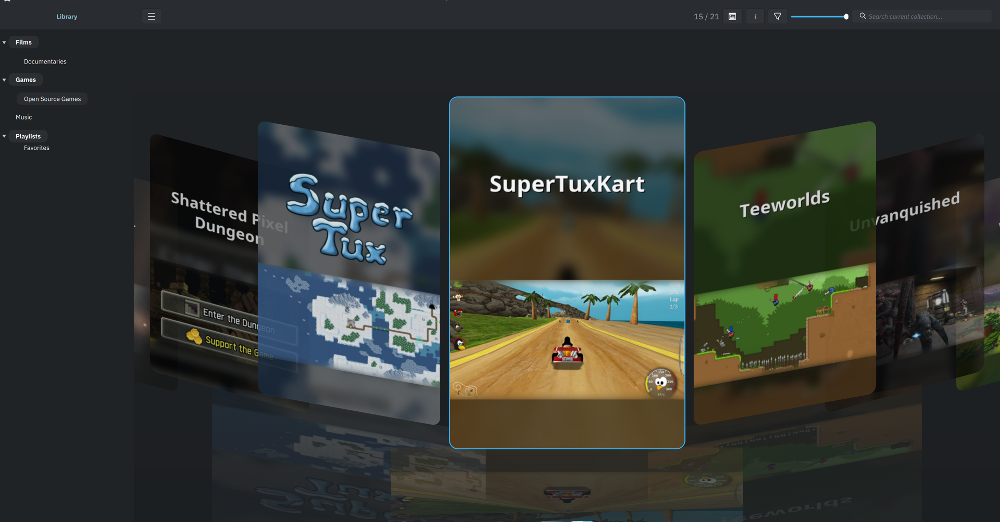
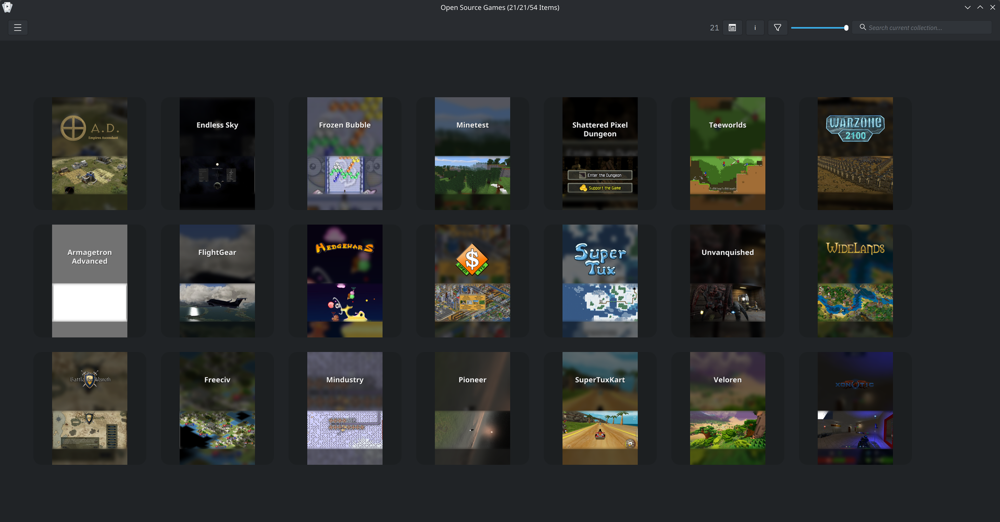

<div align="center">


# Kartend

**Collection &amp; Artwork Frontend for KDE**

[](https://github.com/EtherAura/Kartend/actions/workflows/build.yml)
[](https://github.com/EtherAura/Kartend/actions/workflows/coverage.yml)
[](LICENSE)
[](https://github.com/EtherAura/Kartend/releases)

A highly customizable Qt6 frontend for organizing, browsing, and launching
multimedia collections — videos, audio, reference material, and anything
else you can hand to a launcher.

[**Wiki**](https://github.com/EtherAura/Kartend/wiki) ·
[**Getting Started**](https://github.com/EtherAura/Kartend/wiki/Getting-Started) ·
[**Configuration**](https://github.com/EtherAura/Kartend/wiki/Configuration-Reference) ·
[**Input &amp; Controls**](https://github.com/EtherAura/Kartend/wiki/Input-and-Controls) ·
[**Troubleshooting**](https://github.com/EtherAura/Kartend/wiki/Troubleshooting)

<br>


<sub>Your library, your art, your layout.</sub>

</div>

---

> *Kartend* (German: *carding*) — the mechanical process that aligns cotton,
> wool, or other fibres in the manufacture of textiles. Kartend aligns the
> sprawl of a personal media library into something you actually want to
> open.

## See it

|  |  |
|---|---|
|  | **Collections within collections**<br><sub>Nest a library however it makes sense to you — films, games and music under one parent, each with its own artwork, layout and launcher. <kbd>Enter</kbd> opens, <kbd>Esc</kbd> goes back.</sub> |
|  | **Search as you type**<br><sub>Filters thousands of items instantly. Alphabetic jump and a gamepad get you the rest of the way.</sub> |

### Four layouts

<sub><kbd>Ctrl</kbd>+<kbd>1</kbd>–<kbd>4</kbd> switches between them, without leaving the keyboard.</sub>

|  |  |
|---|---|
| <br><sub>**Grid** — covers first, details beside them.</sub> | <br><sub>**List** — dense, metadata-first browsing.</sub> |
| <br><sub>**Cover Flow** — the marquee browsing mode.</sub> | <br><sub>**Horizontal** — rows that scroll sideways, chrome-free.</sub> |

## Watch it

<!-- ────────────────────────────────────────────────────────────────────────
     Each clip below is a BARE attachment URL alone on its own line, and has to
     stay that way. GitHub swaps the whole block for a player; it does not do
     that inside a table cell, a link, an , or a <video> tag, so wrapping
     one in markup silently leaves it as text. A repo path will not work either
     — docs/media/*.mp4 and raw.githubusercontent.com are served as
     application/octet-stream, so the browser downloads instead of playing.

     The .mp4 files under docs/media/ remain the reference copies: they are
     what .vm/docs-video.py regenerates and what screenshot-credits.md
     accounts for. The URLs here point at GitHub's attachment host, which is a
     separate copy — RE-RECORDING A CLIP DOES NOT UPDATE IT. To refresh one,
     drag the new docs/media/<name>.mp4 into any comment box (it need not be
     submitted; the upload happens on drop) and replace the UUID below.
     Limits: 10MB per video on free plans, 100MB on paid.

     Current mapping, verified by sha256 against the committed files:
       f4298240 collections-tour   1b51da2d library-tour
       44354efc settings-tour      f2a36b7d theming-parallax
     ──────────────────────────────────────────────────────────────────────── -->

#### One library, many kinds of media

Films, games and music as subcollections of a single parent. Drill in, read
the metadata, come back up.

https://github.com/user-attachments/assets/f4298240-68d6-435a-8276-84d223e5e30a

#### Browsing a collection

Hover, select, open the details pane, switch layout, scroll, and filter as
you type.

https://github.com/user-attachments/assets/1b51da2d-5236-4373-8127-83f9d0561713

#### Configuring it

The collection tree, a search that filters the settings themselves, and a
change taking effect on the grid.

https://github.com/user-attachments/assets/44354efc-d891-4d63-b171-c25ff36fd418

#### Making it yours

An image wallpaper with vignette and backdrop blur — and parallax, which only
exists in motion.

https://github.com/user-attachments/assets/f2a36b7d-4eca-4e97-94b3-2f08472b1c5c

<sub>Recorded at 3840×2160, delivered at 1920×1080.</sub>

## Features

- [**Collections**](https://github.com/EtherAura/Kartend/wiki/Collections) — nest them, alias them across parents, or aggregate them
- [**Artwork**](https://github.com/EtherAura/Kartend/wiki/Artwork) — async, cached, scraped or hand-linked
- [**Four layouts**](https://github.com/EtherAura/Kartend/wiki/View-Modes) — grid, list, cover flow, horizontal
- [**Launchers**](https://github.com/EtherAura/Kartend/wiki/Launchers) — per-collection or per-item, with archive extraction
- [**Import**](https://github.com/EtherAura/Kartend/wiki/Launcher-Import) — pull an existing Steam or Flatpak library straight in
- [**Theming**](https://github.com/EtherAura/Kartend/wiki/Themes-and-Appearance) — backgrounds, vignette, parallax, blur, fonts, tints
- [**Input**](https://github.com/EtherAura/Kartend/wiki/Input-and-Controls) — keyboard, mouse and gamepad, fully rebindable
- [**Scale**](https://github.com/EtherAura/Kartend/wiki/Search-Sort-Filter) — virtual scrolling and search-as-you-type over thousands of items

## Install

Every [release](https://github.com/EtherAura/Kartend/releases/latest)
ships a binary `.deb` plus the canonical Arch and Gentoo recipes:

| Platform | Asset | Install |
|--------|-------|---------|
| Debian / Ubuntu | `kartend_<version>_amd64.deb` | `sudo apt install ./kartend_<version>_amd64.deb` |
| Arch Linux | `PKGBUILD` | Drop in a clean dir, `makepkg -si` |
| Gentoo | `kartend-<version>.ebuild` | Place under your local overlay's category dir; `emerge kartend` |
| Windows (installer) | `Kartend-<version>-windows-x64-setup.exe` | Run the installer; Apps & Features-managed uninstall |
| Windows (portable) | `Kartend-<version>-windows-x64.zip` | Unzip anywhere, run `kartend.exe` |

The Windows builds are unsigned, so SmartScreen warns on first launch —
**More info → Run anyway**. Older distros, PGO, sanitizers and a `9999`
Gentoo live build all mean building from source.

## Build from source

```bash
git clone https://github.com/EtherAura/Kartend.git
cd Kartend
.scripts/build.sh            # release build; --install to install
```

Needs CMake 3.20+, a C++23 compiler and Qt 6.4 LTS or later. Per-distro
package lists, debug/sanitizer/PGO modes, manual CMake and CI reproduction
are all in [docs/dev/building.md](docs/dev/building.md).

## Documentation

[User guide](https://github.com/EtherAura/Kartend/wiki) ·
[Architecture](docs/dev/architecture.md) ·
[Building](docs/dev/building.md) ·
[Testing](docs/dev/testing.md) ·
[Contributing](CONTRIBUTING.md) ·
[Security](SECURITY.md) ·
[Changelog](CHANGELOG.md)

<sub>Config lives at <code>~/.config/kartend/kartend.cfg</code> — editable in Settings, or by hand.</sub>

## How this is built

Kartend is developed with AI assistance. Commits co-authored by a model
carry a `Co-Authored-By` trailer — currently around two thirds of the
history — so `git log` shows you exactly which ones.

Every change goes through the same gates regardless of origin: the test
suite, clang-format, clang-tidy, the layering linter, and CI. The
reasoning behind a change lives in its commit message.

## License

[GPL-3.0-only](LICENSE).

Screenshots and recordings show a demo library built from open-licence
material — open-source games, Blender open movies and public-domain music.
CC BY and CC BY-SA require attribution, so every work visible in them is
credited in [docs/media/screenshot-credits.md](docs/media/screenshot-credits.md).

---

<div align="center">

*The sculpture is already complete within the marble block, before I start my work.*<br>
*It is already there, I just have to chisel away the superfluous material.*

Founded 07 / 20 / 2025

</div>
