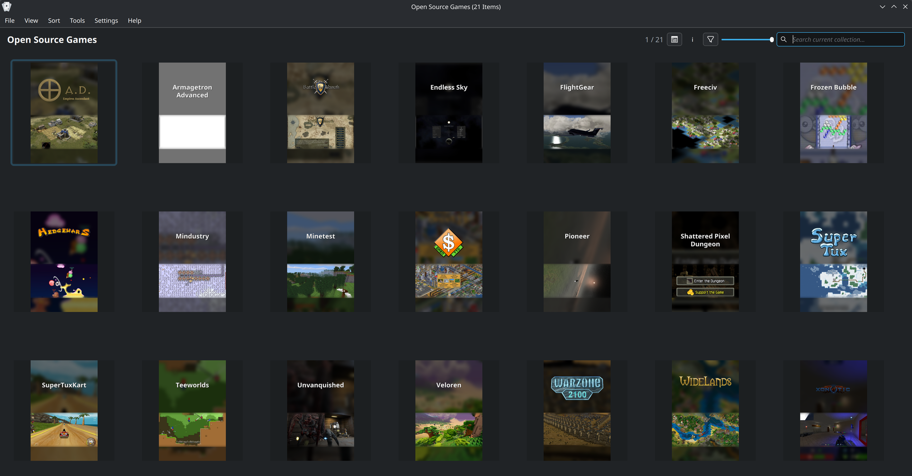
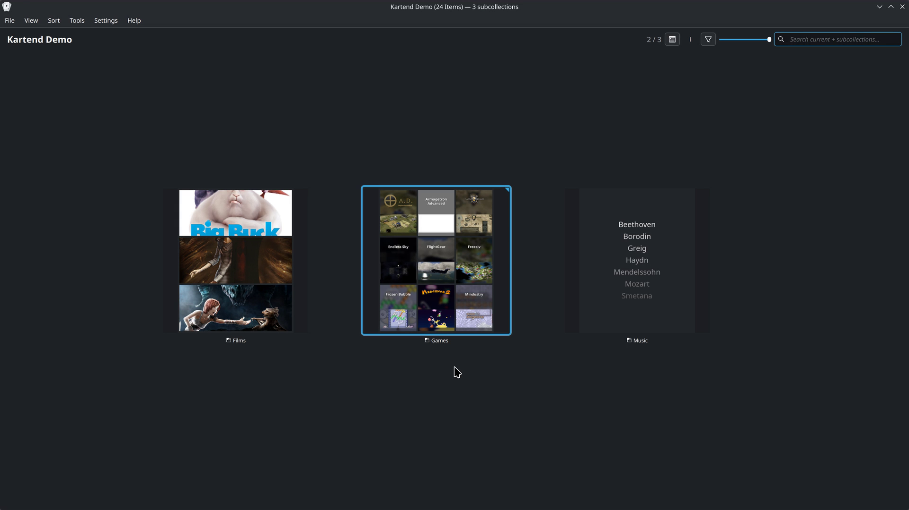
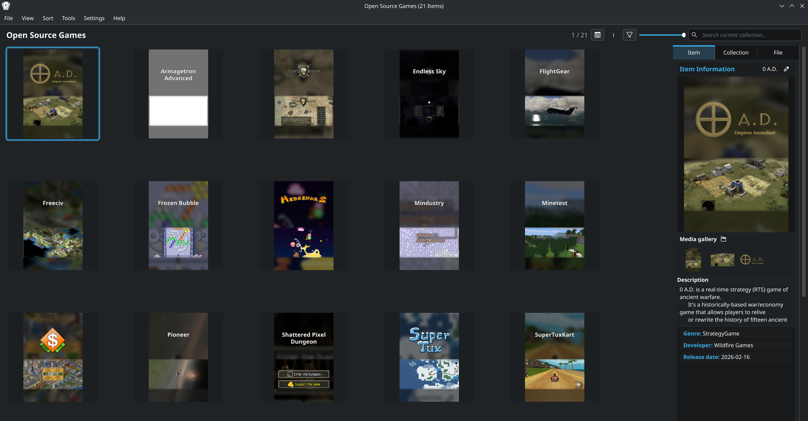
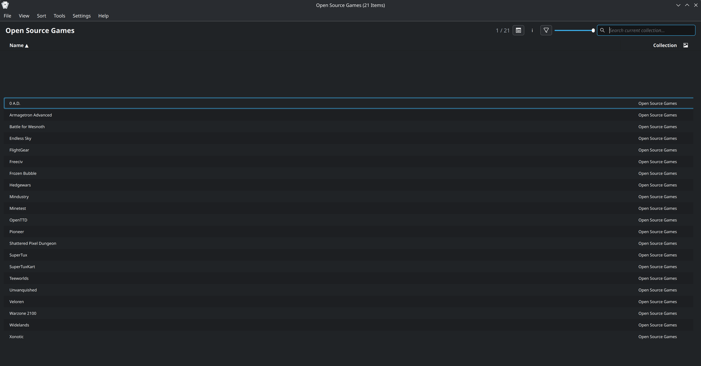
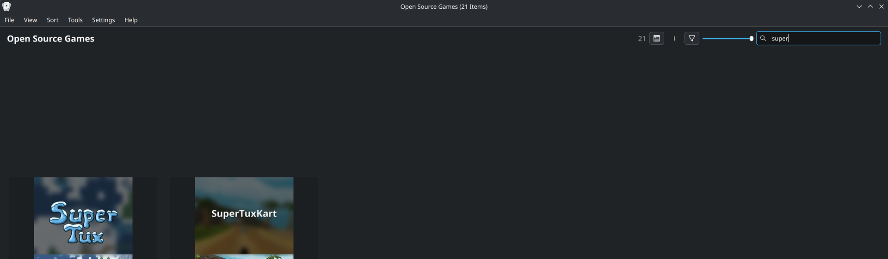

<div align="center">


# Kartend

**Collection &amp; Artwork Frontend for KDE**

[](https://github.com/EtherAura/Kartend/actions/workflows/build.yml)
[](https://github.com/EtherAura/Kartend/actions/workflows/coverage.yml)
[](LICENSE)
[](https://github.com/EtherAura/Kartend/releases)

A highly customizable Qt6 frontend for organizing, browsing, and launching
multimedia collections — videos, audio, reference material, and anything
else you can hand to a launcher.

[**Wiki**](https://github.com/EtherAura/Kartend/wiki) ·
[**Getting Started**](https://github.com/EtherAura/Kartend/wiki/Getting-Started) ·
[**Configuration**](https://github.com/EtherAura/Kartend/wiki/Configuration-Reference) ·
[**Input &amp; Controls**](https://github.com/EtherAura/Kartend/wiki/Input-and-Controls) ·
[**Troubleshooting**](https://github.com/EtherAura/Kartend/wiki/Troubleshooting)

<br>



<sub>Your library, your art, your layout.</sub>

</div>

---

> *Kartend* (German: *carding*) — the mechanical process that aligns cotton,
> wool, or other fibres in the manufacture of textiles. Kartend aligns the
> sprawl of a personal media library into something you actually want to
> open.

## See it

|  |  |
|---|---|
|  | **Collections within collections**<br><sub>Nest a library however it makes sense to you — films, games and music under one parent, each with its own artwork, layout and launcher. <kbd>Enter</kbd> opens, <kbd>Esc</kbd> goes back.</sub> |
|  | **Details at a glance**<br><sub>Cover, media gallery, metadata and file info — without leaving the grid. <kbd>F9</kbd>.</sub> |
|  | **Four layouts**<br><sub>Grid, List, Cover Flow and Horizontal — <kbd>Ctrl</kbd>+<kbd>1</kbd>–<kbd>4</kbd>, without leaving the keyboard.</sub> |
|  | **Search as you type**<br><sub>Filters thousands of items instantly. Alphabetic jump and a gamepad get you the rest of the way.</sub> |

## Watch it

<!-- ────────────────────────────────────────────────────────────────────────
     Each clip below is a BARE attachment URL alone on its own line, and has to
     stay that way. GitHub swaps the whole block for a player; it does not do
     that inside a table cell, a link, an , or a <video> tag, so wrapping
     one in markup silently leaves it as text. A repo path will not work either
     — docs/media/*.mp4 and raw.githubusercontent.com are served as
     application/octet-stream, so the browser downloads instead of playing.

     The .mp4 files under docs/media/ remain the reference copies: they are
     what .vm/docs-video.py regenerates and what screenshot-credits.md
     accounts for. The URLs here point at GitHub's attachment host, which is a
     separate copy — RE-RECORDING A CLIP DOES NOT UPDATE IT. To refresh one,
     drag the new docs/media/<name>.mp4 into any comment box (it need not be
     submitted; the upload happens on drop) and replace the UUID below.
     Limits: 10MB per video on free plans, 100MB on paid.

     Current mapping, verified by sha256 against the committed files:
       f4298240 collections-tour   1b51da2d library-tour
       44354efc settings-tour      f2a36b7d theming-parallax
     ──────────────────────────────────────────────────────────────────────── -->

#### One library, many kinds of media

Films, games and music as subcollections of a single parent. Drill in, read
the metadata, come back up.

https://github.com/user-attachments/assets/f4298240-68d6-435a-8276-84d223e5e30a

#### Browsing a collection

Hover, select, open the details pane, switch layout, scroll, and filter as
you type.

https://github.com/user-attachments/assets/1b51da2d-5236-4373-8127-83f9d0561713

#### Configuring it

The collection tree, a search that filters the settings themselves, and a
change taking effect on the grid.

https://github.com/user-attachments/assets/44354efc-d891-4d63-b171-c25ff36fd418

#### Making it yours

An image wallpaper with vignette and backdrop blur — and parallax, which only
exists in motion.

https://github.com/user-attachments/assets/f2a36b7d-4eca-4e97-94b3-2f08472b1c5c

<sub>Recorded at 3840×2160, delivered at 1920×1080.</sub>

## Features

- **Virtual scrolling** — handles thousands of items via widget pooling
- **Async artwork** — parallel `QtConcurrent` pipeline with intelligent caching
- **Hierarchical collections** — parents, alias parents, shell groupings, subcollection navigation
- **Persistent sessions** — selection, scroll position, and view state restored across restarts
- **Configurable launchers** — per-collection or per-item, with archive extraction and presets
- **Keyboard, mouse &amp; gamepad** — fully rebindable; alphabetic jump; search-as-you-type
- **Theming** — image / video backgrounds, vignette, parallax, backdrop blur, fonts, tints
- **Smooth animations** — glide selection and scroll with configurable easing

The full feature tour lives in the [user guide](https://github.com/EtherAura/Kartend/wiki).

## Install

Every [release](https://github.com/EtherAura/Kartend/releases/latest)
ships a binary `.deb` plus the canonical Arch and Gentoo recipes:

| Platform | Asset | Install |
|--------|-------|---------|
| Debian / Ubuntu | `kartend_<version>_amd64.deb` | `sudo apt install ./kartend_<version>_amd64.deb` |
| Arch Linux | `PKGBUILD` | Drop in a clean dir, `makepkg -si` |
| Gentoo | `kartend-<version>.ebuild` | Place under your local overlay's category dir; `emerge kartend` |
| Windows (installer) | `Kartend-<version>-windows-x64-setup.exe` | Run the installer; Apps & Features-managed uninstall |
| Windows (portable) | `Kartend-<version>-windows-x64.zip` | Unzip anywhere, run `kartend.exe` |

The `.deb` is built on Ubuntu 24.04 with the same flags this project's
[`packaging/PKGBUILD`](packaging/PKGBUILD) uses; runtime deps are
resolved against the stock Qt6 stack in Debian Trixie and
Ubuntu 24.04+. Older distros — or anyone who wants PGO, sanitizers,
or a `9999` Gentoo live build — should build from source via the
[quick start](#quick-start-from-source) below.

Both Windows artifacts are built on `windows-latest` with MSVC 2022 +
Qt 6.7 LTS and ship Qt's DLLs alongside `kartend.exe` (windeployqt-
bundled). The installer puts Kartend under `%ProgramFiles%\Kartend`
with a Start Menu entry and registers with Apps & Features for normal
uninstall; the portable `.zip` unzips anywhere and needs no admin.
Windows SmartScreen may warn on first launch since the artifacts are
unsigned — click **More info → Run anyway**. Code signing is on the
roadmap.

The release page also carries the source tarball
(`Kartend-<version>.tar.gz`) and a `.sha256` for each asset.

## Quick start (from source)

```bash
# Debian / Ubuntu (build deps only — the --maintenance lint gate needs extra
# tooling: clang-format-19, clang-tidy, cppcheck, iwyu — see docs/dev/building.md)
sudo apt install clang cmake lld ninja-build ccache \
  qt6-base-dev qt6-multimedia-dev libqt6sql6-sqlite \
  qt6-tools-dev qt6-l10n-tools qtkeychain-qt6-dev

git clone https://github.com/EtherAura/Kartend.git
cd Kartend
.scripts/build.sh                # optimized release build
.scripts/build.sh --install      # build + install (auto-elevates)
```

The [`.scripts/build.sh`](.scripts/build.sh) wrapper auto-detects
Ninja, lld, and ccache, and keeps each flavor in its own tree
(`build/ninja-release`, `build/ninja-debug`, …). Run
`.scripts/build.sh --help` for the full flag list, or see
[docs/dev/building.md](docs/dev/building.md) for PGO, sanitizers, custom
toolchains, manual CMake, packaging, and uninstall.

### Dependencies

CMake 3.20+, a C++23 compiler (Clang or GCC), and **Qt 6.4 LTS or
later** (Core, Gui, Widgets, Sql, Concurrent, Multimedia,
MultimediaWidgets, Network, LinguistTools). Optional: **Qt6 Gamepad**
*or* **SDL2** (gamepad backend, auto-detected) and **zstd**
(auto-detected; falls back to zlib via `qCompress`).

A cold release build takes roughly **5–10 minutes** on modern hardware
the first time through; subsequent ccache-hit incremental builds finish
in ~30 seconds. See [`docs/dev/building.md`](docs/dev/building.md) for distro
package lists, debug/sanitizer/PGO modes, and CI reproduction.

## Documentation

- **User guide / wiki** — [github.com/EtherAura/Kartend/wiki](https://github.com/EtherAura/Kartend/wiki)
- **Build &amp; packaging** — [docs/dev/building.md](docs/dev/building.md)
- **Architecture** — [docs/dev/architecture.md](docs/dev/architecture.md)
- **Testing** — [docs/dev/testing.md](docs/dev/testing.md)
- **Contributing** — [CONTRIBUTING.md](CONTRIBUTING.md)
- **Security policy** — [SECURITY.md](SECURITY.md)

Configuration is stored as INI at `~/.config/kartend/kartend.cfg`,
editable from the **Settings** dialog or by hand.

## License

[GPL-3.0-only](LICENSE).

Screenshots and recordings show a demo library built from open-licence
material — open-source games, Blender open movies and public-domain music.
CC BY and CC BY-SA require attribution, so every work visible in them is
credited in [docs/media/screenshot-credits.md](docs/media/screenshot-credits.md).

---

<div align="center">

*The sculpture is already complete within the marble block, before I start my work.*<br>
*It is already there, I just have to chisel away the superfluous material.*

Founded 07 / 20 / 2025

</div>
